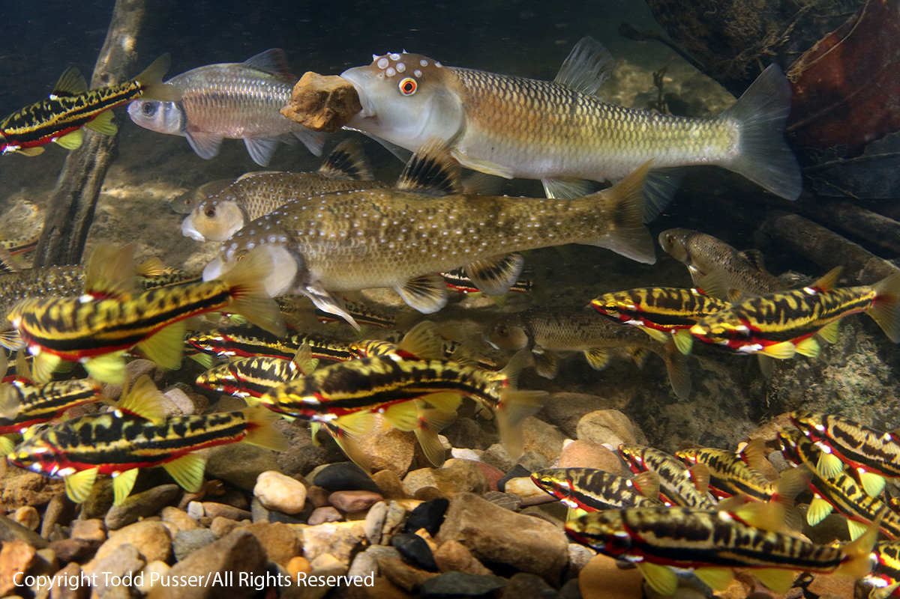

# Embryo Distribution within Bluehead Chub Nests

The following repository contains data, code, and information related to a study conducted by the Frimpong Lab at Virginia Tech, which investigated the distribution of Leuciscid embryos within bluehead chub nests in Toms Creek, near Blacksburg, VA, USA from 2021-2023.

Primary Contacts: Maddie Betts (mmbetts03@gmail.com), Emmanuel Frimpong (frimp@vt.edu)

## Background

Bluehead chub (*Nocomis leptocephalus*) is a species of Leuciscid common across the southeast United States. They are known for the large, mounded nests they construct out of streambed pebbles that attract other species of Leuciscids as "nest associates," which spawn with bluehead chub. The relationship between bluehead chub and nest associates is thought to be mutualistic, however, mutualisms are inherently selfish interactions, with all participating parties attempting to benefit without cost. We investigated the distribution of different species' embyros on nests of bluehead chub to determine if the chub is disproportionately benefiting from the relationship by positioning its embryos such that those of its nest associates are forced to the less-desirable nest periphery. 

*A bluehead chub sets a stone on its nest, amidst a swarm of nest associates.*

## Objective

The objective of this study was to determine whether certain species in the heterospecific spawning aggregation on a bluehead chub nest predominantly benefit from the protection of the nest as opposed to a random mix of embryo that would afford every participant an equal benefit.

## 

## R